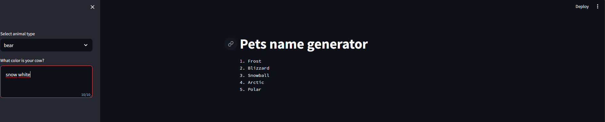

# Langchain pet name generator

This is a simple project that works as a pet name generator to exercise core langchain and openai concepts

## How to set up this project

1. Clone the repo: ``git clone https://github.com/williambrunos/langchain_llm_app.git``
2. Create an OpenAI account
3. Create and get your OpenAI API Key on your account
4. Rename `.env.example` file to `.env`
5. On the `.env` file, create a variable named `OPENAI_API_KEY = "<<YOUR_KEY>>`

## How to run this project

Run this command on your prompt window at the root of the project:

````Bash
streamlit run main.py
````

## How to use the app

1. Chose the type of animal within the options
2. Write the color of the animal
3. Press CTRL+ENTER or related to apply and get sugestions from ChatGPT



